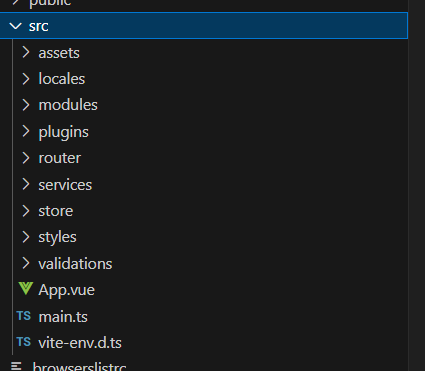
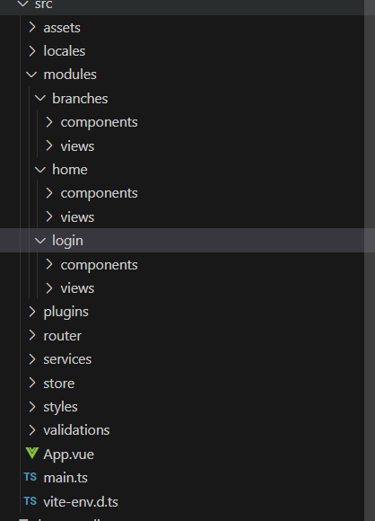
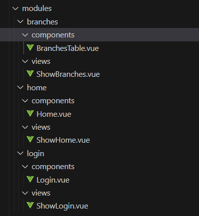
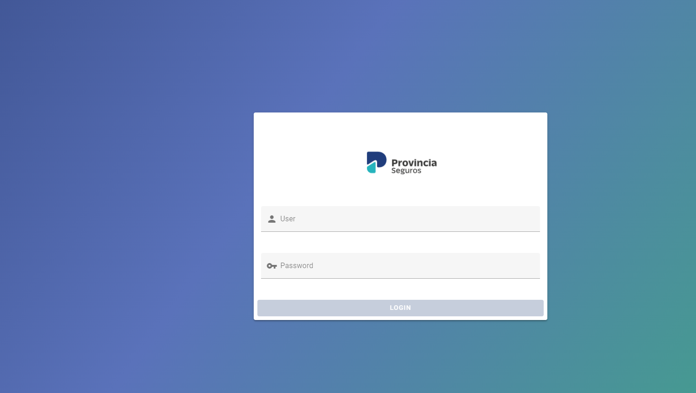
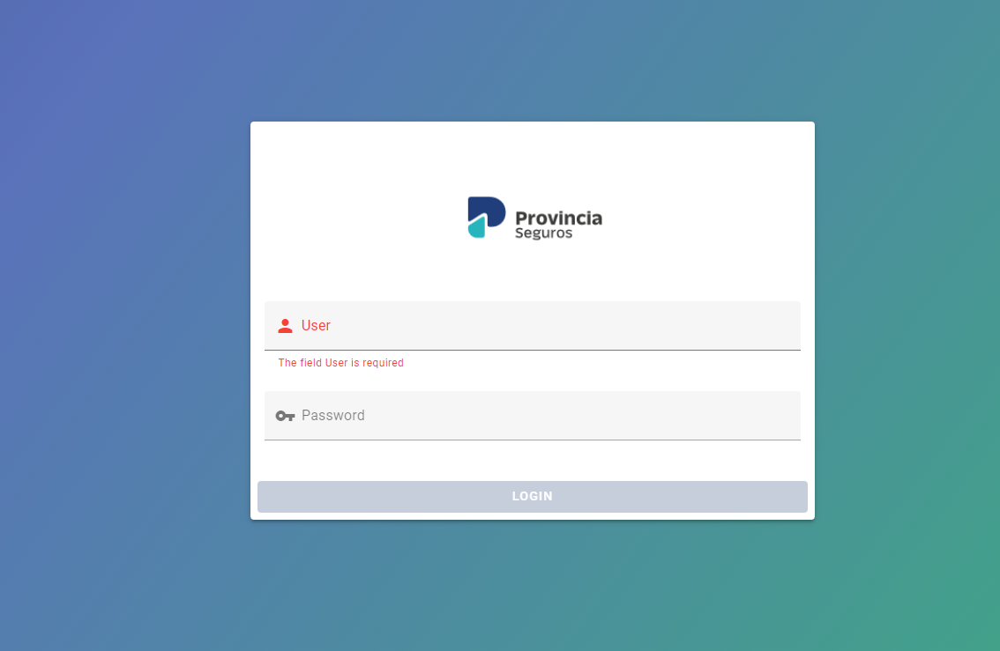
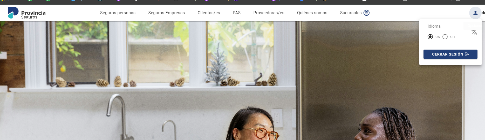
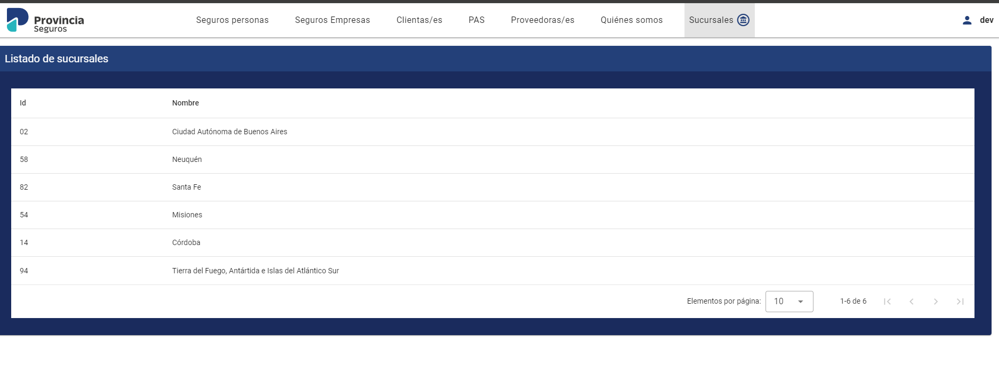

# Ejercicio frontEnd vue.js Provincia Seguros

**Nombre:** Facundo Ignacio

**Apellido:** Salas

**Contacto:** facundosalasu19@gmail.com

**Importante** este proyecto fue realizado utilizando la version **20.16.0** de node
en caso de tener una version distinta recomiendo utilizar node version manager
https://github.com/coreybutler/nvm-windows/releases

link a descarga directa instalador de windows https://github.com/coreybutler/nvm-windows/releases/download/1.1.12/nvm-setup.exe

```
nvm install 20.16.0
```

```
nvm use 20.16.0
```

node -v para chequear version de node

para ejecutar el proyecto:

```
 npm i
```
```
 npm run dev
```
ir al localhost por defecto http://localhost:3000/

# Notas del proyecto y navegación

Mas alla de los requerimientos brindados este proyecto lo realice asumiendo que es un proyecto nuevo que puede escalar a largo plazo
y que debia ser mantenido por mucho tiempo dicho esto decidi utilizar las siguientes herarmientas:

Vue 3 (Vue 2 ya dejo de recibir soporte)<br /><br /> 
TypeScript , considerando que se pueden llegar a manejar datos sensibles y la aplicacion debe tener una robustez garantizada decidi utilizar typescript.<br /> <br />
Pinia, en la documentacion de vue dicen que si bien vuex funciona correctamente el mismo se encuentra fuera de mantenimiento y no recibira mas actualizaciones a futuro por ende decidi utilizar pinia.

importante tambien se esta utilizando el paquete piniaPluginPersistedstate para persistir el estado de pinia en localstorage de esta forma al refrescar la aplicacion el estado no se pierde y este solo se afecta mediante mutaciones.
<br /><br /> 

## Librerias y frameworks
considerando la posibilidad de que el proyecto crezca decidi de entrada integrarlo con funciones que pueden ayudar a un desarrollo mas agil a futuro.<br /> <br />
implemente vuetify que se rige por las reglas de material design garantizando un diseño consistente y familiar al usuario.<br /><br />

i18n si bien no era requerimiento no vi el por que no aprovechar e implementar tambien i18n en un hipotetico caso que la aplicacion la usaran otras personas que no hablen el idioma español, ahora mismo la aplicacion maneja tanto ingles como español.<br /><br />

vee-validate, si bien las reglas de validacion solicitadas eran simples y podian hacerse con script unicamente, preferi implementar validaciones de vee-validate por que permite centralizar toda la logica de las validaciones en 1 solo punto y luego usarlas facilmente en la aplicacion manteniendo la consistencia de las validaciones.<br /> <br />

se utilizo axios para realizar las peticiones solicitadas.

## Nota personal:
Personalmente tenia poca experiencia con vue 3 , typescript y pinia, podria haber realizado el proyecto en la version 2 de vue con javascript con la cual me siento mas comodo por que es lo que uso actualmente, pero preferi aprovechar para practicar y aprender mas de vue 3 ademas de que a futuro va a ser mas mantenible que vue 2.

## Estructura del proyecto
decidi estructurar el proyecto de la siguiente forma asumiendo que cada vista es un modulo independiente que puede crecer a futuro y tener mas funciones.



ignorando el resto de carpetas que son configuraciones de librerias, stores de pinia o archivos de recursos como imagenes o traducciones.<br />

cada carpeta dentro de module contiene las vistas que corresponden al router y los componentes que se renderizan dentro de esas vistas.<br />




## Navegacion del proyecto

ruta '/' login



validaciones , si se hace focus y no se completa el campo las validaciones se activan y no se puede loguear hasta completar ambos campos.




desde la vista home se puede acceder a sucursales, tambien si damos click al boton de usuario
se despliega un menu desde el que podremos cerrar la sesion o cambiar el idioma.

 
 vista sucursales

 